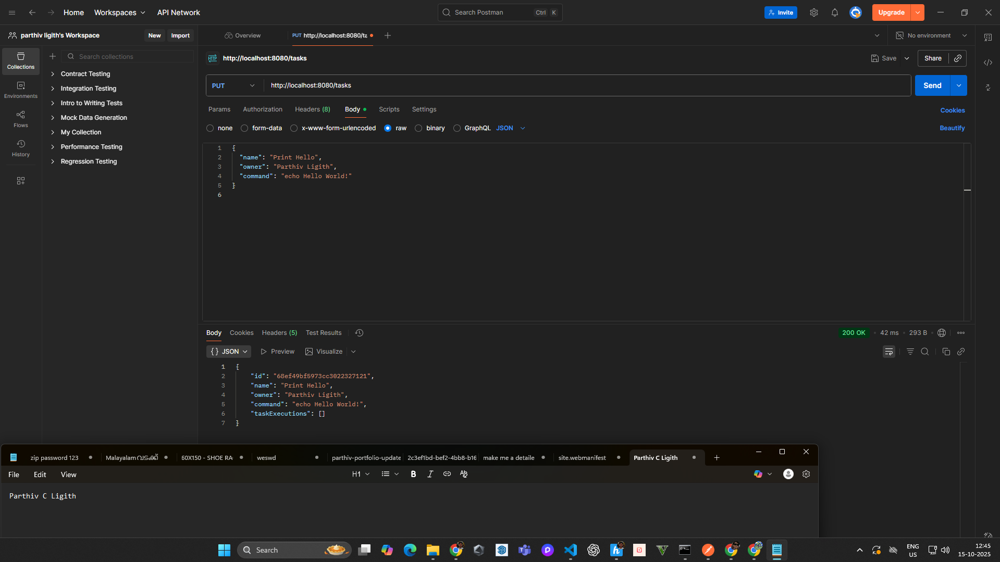
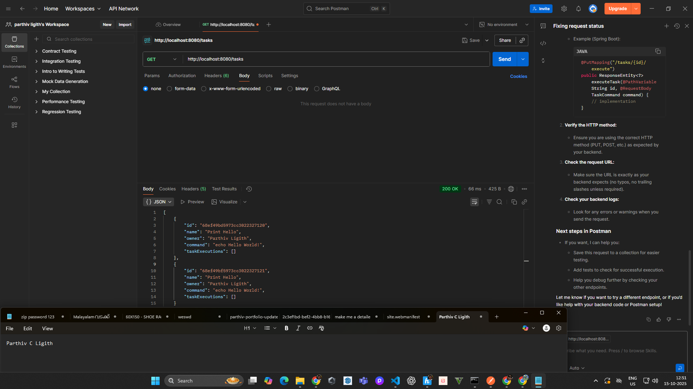
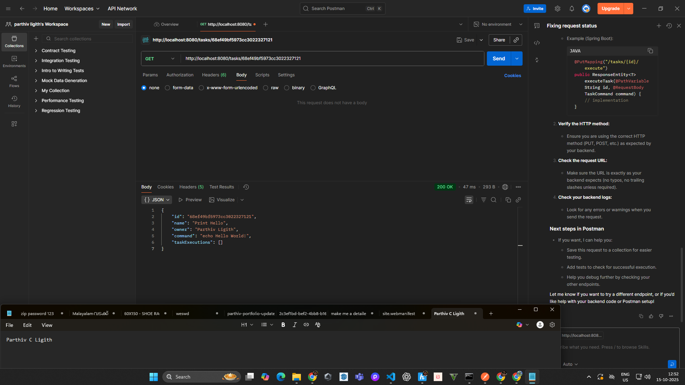
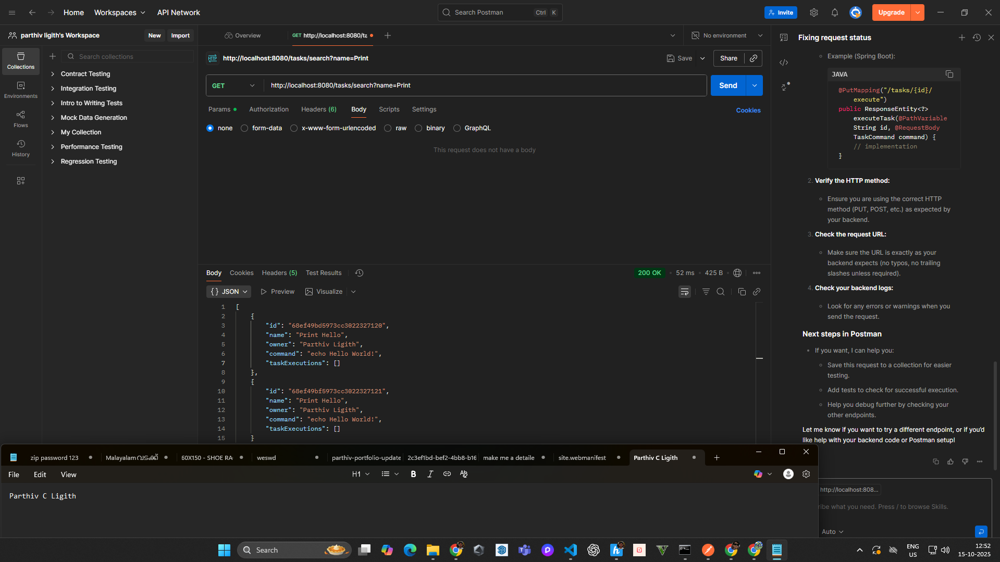
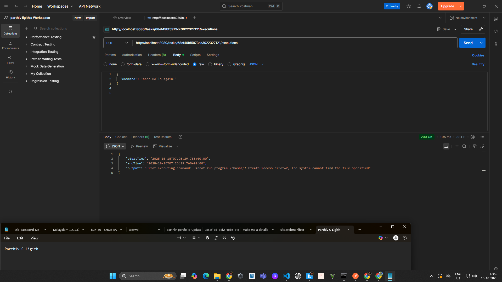

# TaskManager - Task 1 Kaiburr

## Description
A Spring Boot application that allows creating, updating, deleting, and executing tasks stored in MongoDB. 

## Features
- Create and update tasks
- Delete tasks
- Run shell commands for tasks
- View all task executions
- Search tasks by name

## Tech Stack
- Java 25
- Spring Boot 3.5.6
- MongoDB Atlas
- Maven

## Setup Instructions
1. Clone the repo:
   ```bash
   git clone https://github.com/USERNAME/REPO_NAME.git


## Screenshots






